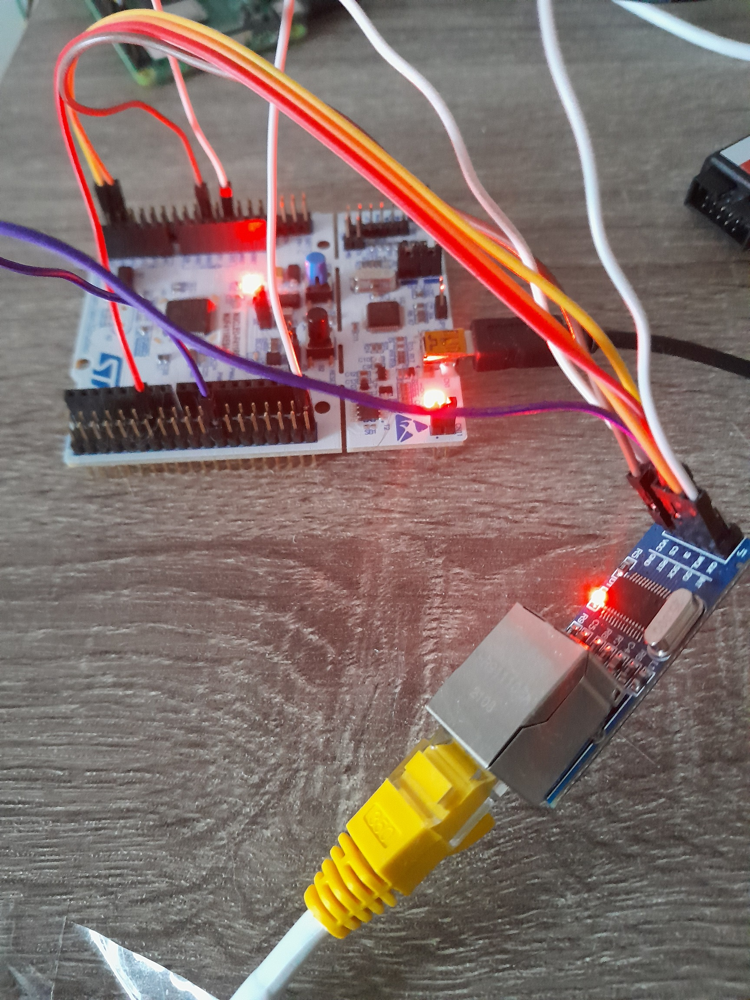

# stm32_network_stack
Integration of [ENC28J60 Ethernet module](https://m.media-amazon.com/images/I/51SUmloDjrL.jpg) into [STM32 Nucleo board](https://www.st.com/en/evaluation-tools/nucleo-f411re.html). The goal is to be able to ping the STM32 board from the host machine.

[FreeRTOS](https://www.freertos.org/) is used to manage the application tasks:
* *eth_packet_task*: task handling I/O of the raw ethernet packets
* *ip_stack_task*: task handling processing of the IP layer (here: ping requests). The [lwIP library](https://savannah.nongnu.org/projects/lwip/) is used for processing the packets.

## Repository content

* [**/doc**](./doc): various documentation files (datasheets etc)
* [**/enc28j60**](./enc28j60): ENC28J60 driver source code
* [**/stm32_app**](./stm32_app): test application for STM32 Nucleo, integrating the ENC28J60 driver
* [**/third_party**](./third_party): source code of FreeRTOS and lwIP library

## STM32 Nucleo peripheral configuration and external connectors

|Pin header|Pin id|Pin name|Function|
|-|-|-|-|
|CN7|16|+3.3V|Input current to the Ethernet cap|
|CN7|20|GND|Ground connection|
|CN7|35|PC2|SPI2 MISO|
|CN7|37|PC3|SPI2 MOSI|
|CN19|1|PC9|GPIO Input: interrupt pin (falling edge)|
|CN19|16|PB12|SPI2 NSS|
|CN19|25|PB10|SPI2 Clock|

 - SPI2:
	* mode:	 0, 0
	* speed:  10Mbit/s

## Setup overview

For simplicity a static IP address 192.168.0.22 is assigned to the ENC28 ethernet module. The interface can be pinged from host:

```
$ping 192.168.0.22

Pinging 192.168.0.22 with 32 bytes of data:
Reply from 192.168.0.22: bytes=32 time=87ms TTL=128
Reply from 192.168.0.22: bytes=32 time=68ms TTL=128
Reply from 192.168.0.22: bytes=32 time=68ms TTL=128
Reply from 192.168.0.22: bytes=32 time=66ms TTL=128
```

